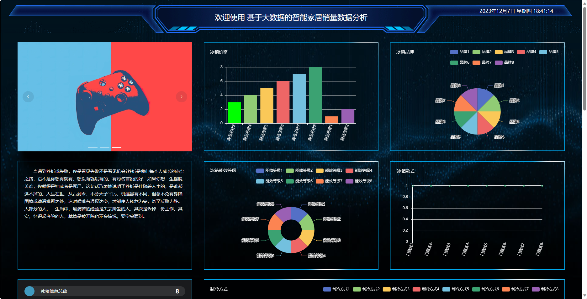
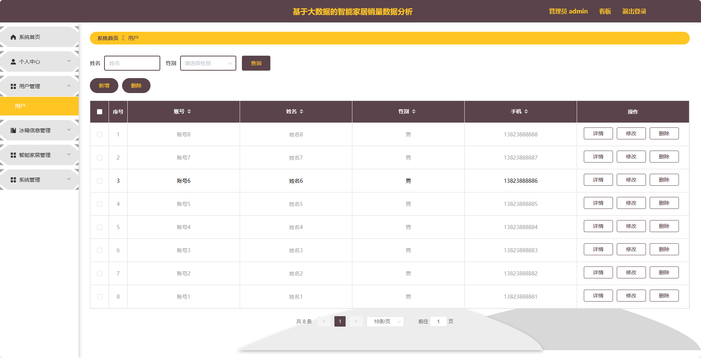
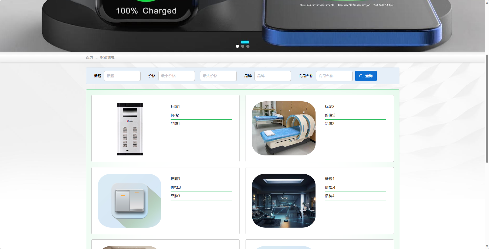
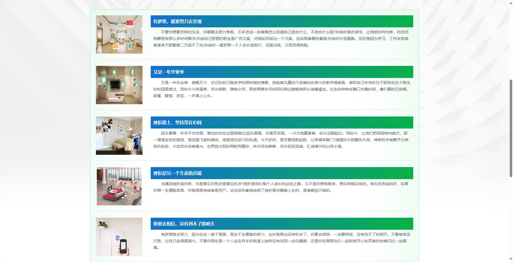
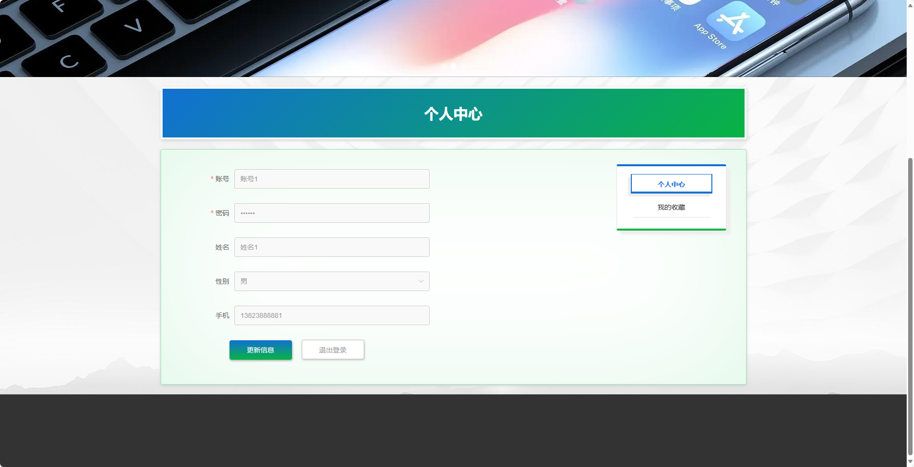

基于SpringBoot的智能家居销量数据分析
=
- 完整代码获取地址：从戎源码网 ([https://armycodes.com/](https://armycodes.com/))
- 作者微信：19941326836  QQ：952045282 
- 承接计算机毕业设计、Java毕业设计、Python毕业设计、深度学习、机器学习
- 选题+开题报告+任务书+程序定制+安装调试+论文+答辩ppt 一条龙服务
- 所有选题地址https://github.com/nature924/allProject

一、项目介绍
---
基于Spring Boot框架实现的智能家居销量数据分析，系统包含两种角色：管理员、用户,系统分为前台和后台两大模块，主要功能如下。

### 前台：

1. 首页：展示智能家居产品的最新信息和推荐内容。
2. 冰箱信息：提供冰箱产品的详细信息和特点介绍。
3. 智能家居：展示智能家居产品的种类、功能等信息。
4. 智能家居资讯：提供智能家居行业的最新资讯和动态。
5. 个人中心：用户可以管理个人信息，包括修改密码、查看订单历史等操作。

### 后台：

### 管理员：
1. 系统首页：展示系统的概览信息和数据统计。
2. 个人中心：管理员可以管理个人信息，包括修改密码等操作。
3. 用户管理：管理员可以管理用户信息，包括查看用户列表、禁用用户等操作。
4. 冰箱信息管理：管理员可以管理冰箱产品的信息，包括添加、编辑、删除等操作。
5. 智能家居管理：管理员可以管理智能家居产品的信息，包括添加、编辑、删除等操作。
6. 系统管理：管理员可以管理系统的参数设置、日志查看等功能。

### 用户：

1. 个人中心：用户可以管理个人信息，包括修改密码、查看订单历史等操作。

二、项目技术
---
- 编程语言：Java
- 数据库：MySQL
- 项目管理工具：Maven
- 前端技术：VUE、HTML、Jquery、Bootstrap
- 后端技术：Spring、SpringMVC、MyBatis

三、运行环境
---
- 操作系统：Windows、macOS都可以
- JDK版本：JDK1.8以上都可以
- 开发工具：IDEA、Ecplise、Myecplise都可以
- 数据库: MySQL5.7以上都可以
- Tomcat：任意版本都可以
- Maven：任意版本都可以

四、运行截图
---

### 程序截图：

